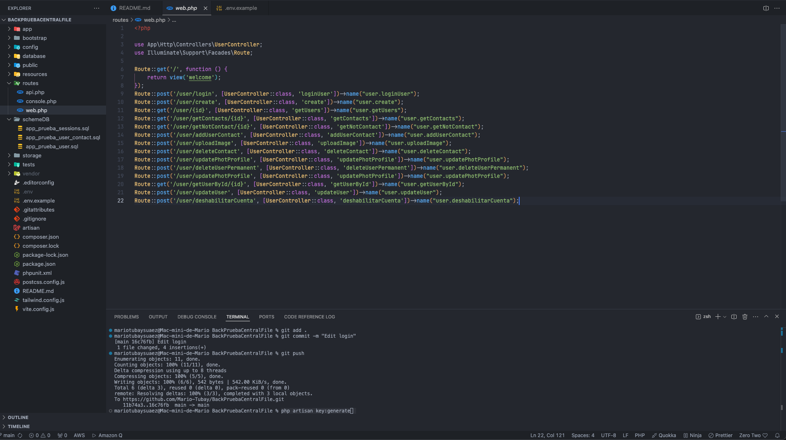
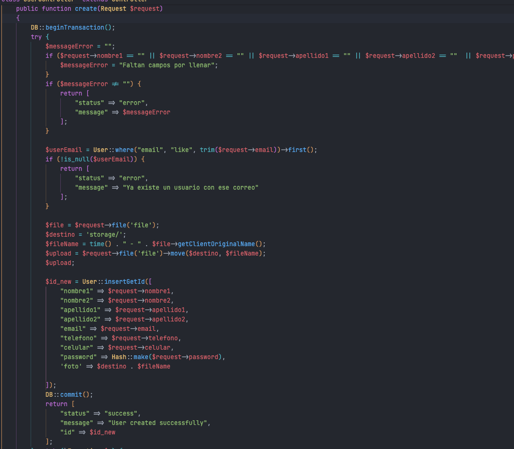

## 🖥️ Pasos para el uso

Este backen se subio a un servidor que tenia disponible con el dominio por motivas de pruebas lo use [facturalgo.com](https://www.facturalgo.com), ahi que tomar en cuenta que solo lo use para backend.

## Instalación
1. Puede seguir los pasos de instalacion en la documentacion oficial [Laravel](https://laravel.com/docs/11.x/installation)
2. Clonar el repositorio usando el comando `https://github.com/Mario-Tubay/BackPruebaCentralFile.git`.
3. Crear una base de datos los archivos los puedes encontrar en la carpeta `/schemeDB` que estaran las tablas
4. Editar el `env.example`, cambiarle de nombre a `.env`  
5. Ejecutar los comandos comando.
```bash
composer install
php artisan key:generate  
```
6. Una vez seguido los estos pasos el ambiente debe funcionar correctamente 


Los endpint los puede revisar en `routes/web.php`

### ¿Cómo decidió las opciones técnicas y arquitectónicas utilizadas como parte de su solución?
Use Laravel en el backend, como sabemos este Framework esta basado en el lenguage de programación `PHP`, aqui las opciones por las que me decidi por este Framework 
1. Facilidad de aprendizaje 
2. Integracion muy facil de APIs
3. Desarrollar en este Framework es super sencillo y rapido, la sintaxis de codigo es intuitiva

Para las contraseñas se encriptaron para que sea dificil acceder a ellas

### ¿Qué haría de manera diferente si se le asignara más tiempo?
1. Mejoras en las consultas, para que el rendimiento sea el mas optimo posible
2. Mas tiempo para realizar pruebas 

###  ¿Para casos donde se deben guardar grandes cantidades de datos como por ejemplo varias fotos de alta calidad, que lógica manejaría para que la aplicación funcione de la forma más óptima?
Para estos casos se podria aplicar algunas estrategias 

1. El uso de de servicios en las nube: Como sabemos el manejor de imagenes aveces es un poco tedioso por suerte hay servicios que nos ayudan por mencionar algunos tenemos a [Cloudinary](https://cloudinary.com/) este servicio aparte de guardar en la nube las fotos tiene varios servicios mas como reducir imagen para al momento de usar api cargar el que se necesita especificamente, al igual tenemes [AWS](https://aws.amazon.com/es/).

2. Si lo estamos guardando en servidores propios o terceros lo mejor para que el espacio no se llene seria comprimir las imagenes, reducir su tamaño o su tipo, por ejemplo WebP que se esta usando cada vez mas porque es mas liviano.


### Algunas imagenes de la App 

### End Point




### Encriptacion de contraseña y subida de imagen al servidor

